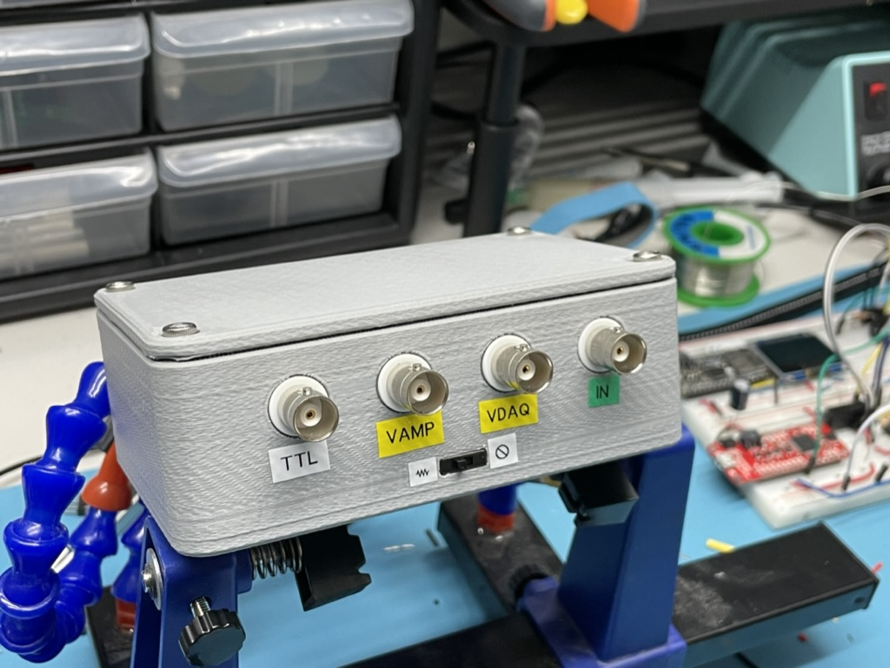
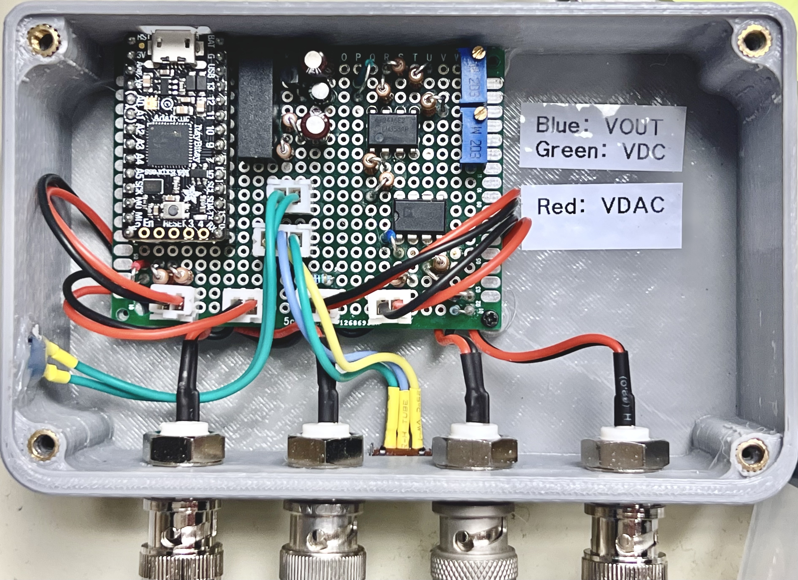

# Prototype Notes

A single prototype version (considered ODC 1.0) was constructed on proto-board and hand soldered with jumper wires. 
This revision was used by the [Covarrubias Lab, Dep. of Neuroscience at Thomas Jefferson University](https://research.jefferson.edu/labs/researcher/covarrubias-laboratory.html).

### Differences to ODC 1.2

- The prototype was constructed with an LM358 OpAmp for the output signal. Version 1.2 recommends the pin-compatible TLE2142 OpAmp an included an additional filtering capacitor to reduce ringing artifacts.
- The prototype used an external 3.3V regulator instead of the ItsyBitsy's onboard 3.3V regulator.
- Additional bypass capacitors for the voltage rails are not present in the prototype.
- The tolerance of resistor components (5-10%) on the prototype necessitated additional calibration.
- The configuration of the trim potentiometers to adjust output signal offset and gain has been changed to improve stability from thermal variance.
- Proto-board construction (this has not shown a measurable difference compared to the
PCB version).
- Additional pins from the ItsyBitsy are exposed on user accessible headers for ADC inputs and SWD Debugging.
- The BNC ports are not in the same physical order (irrelevant)

### Build Images

