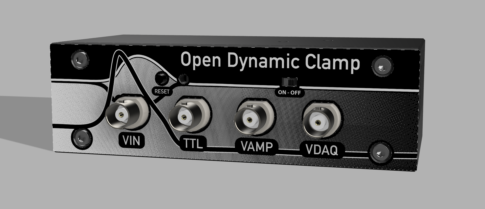

# Open Dynamic Clamp 1.2

### Notable Features
- 100% compatible with existing Arduino firmware
- Using the [Adafruit ItsyBitsy M4](https://learn.adafruit.com/introducing-adafruit-itsybitsy-m4) microcontroller (SAMD51 MCU)
- Simplified power circuitry
  - USB used to source all power, no additional DC input required
  - 3.3V sourced from the ItsyBitsy's built-in voltage regulator
  - Op amp dual rail provided by 5V to +/-12V DC-to-DC module
- TLE2142 Op amp replaces LM358 for improved signal quality
- Trim potentiometers for Op amp gain and offset adjustment
- Expansion port for additional ADC inputs
- Tag-Connect Plug-of-Nails debugging header
- Fully specified BOM with the highest quality components

### Project Files

- [Hardware PCB Guide](./hardware/README.md)
  - KiCad Project
- [3D Printed Enclosure Guide](./hardware/rack-mount-enclosure/README.md)
  - STL Files
  - Faceplate Graphic

