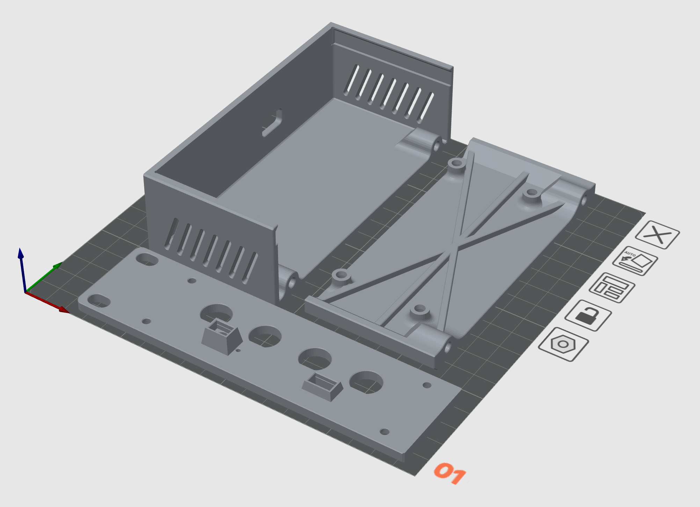

# 3D Printed Enclosure Guide

For printing a rack mount or desktop enclosure the following files are used.
There are various options for face-plates.

#### STL Files
- Faceplate options (choose one)
  - faceplate-ears-left.stl (rack mount holes on left)
  - faceplate-ears-right.stl (rack mount holes on right)
  - faceplate-no-ears.stl (desktop use, no mounting holes)
- pcb_sled.stl (pcb mounting bracket)
- cover.stl (enclosure cover)

### Fusion 360 Files
A Fusion 360 project (.f3z) is provided for anyone looking to make modifications to the design.

#### Hardware
- 8 M3 heat-set inserts
- 8 M3 6mm bolts

## 3D Printing Notes

- All parts will fit together on a 200x200 build plate
- Slicer recommendations
  - PLA filament
  - 0.3 layer height
  - No supports or supports only for usb cable opening

## Faceplate Graphic Notes

Graphic is designed to be printed on a B&W laser printer using Avery 5526 shipping labels.

- Cut out the cross-hatched areas carefully with a new exacto blade.
- Some overlap on edges to be cut has been designed into the graphic so that cuts always happen on black which blends with black 3d printing filament.